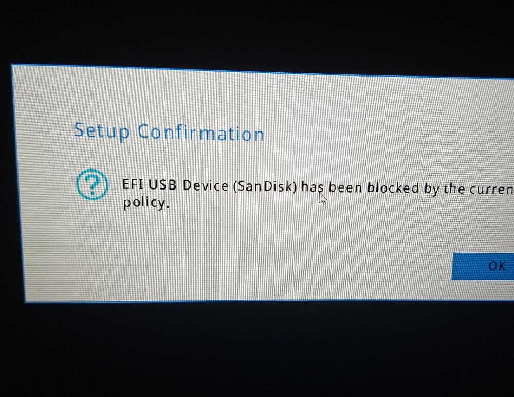

# Erros encontrados enquanto tentei instalar e aprendi com isso

# USB bloqueado pelo Secure Boot

## Problema
Ao tentar dar boot pelo pendrive com a ISO do Arch Linux, a mensagem apareceu:

> EFI USB Device (SanDisk) has been blocked by the current policy.

## Causa
O Secure Boot da BIOS do Acer Nitro V15 estava ativado e bloqueava dispositivos não assinados.

## Solução
1. Acessei a BIOS (tecla F2 durante o boot).
2. Fui em **Security** → **Secure Boot**.
3. Mudei de **Enabled** para **Disabled**.
4. Salvei e saí (F10).

Após desabilitar o Secure Boot, o pendrive bootou normalmente.

